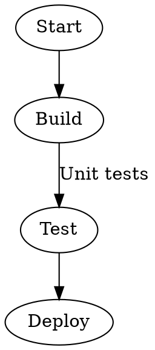
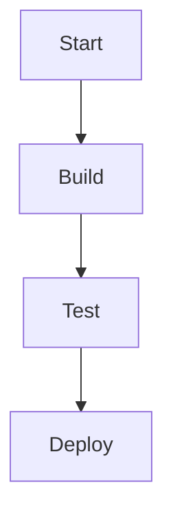
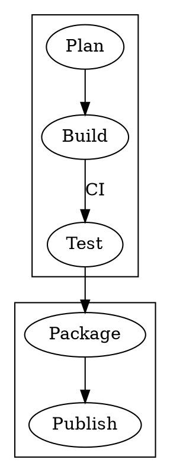
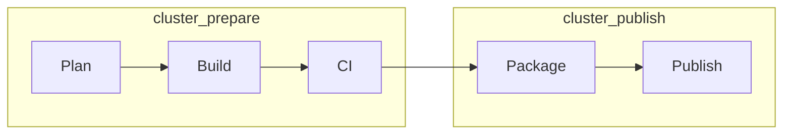

# dot2mermaid

Convert Graphviz DOT diagrams to Mermaid flowcharts for README files, Markdown documentation, design notes, and CI-generated docs.

## Install

```bash
npm install dot2mermaid
```

For local development in this repository:

```bash
npm install
npm test
```

## CLI Usage

Convert a DOT file and print Mermaid to stdout:

```bash
npx dot2mermaid ./examples/simple.dot
```

Write the Mermaid output to a file:

```bash
npx dot2mermaid ./examples/simple.dot -o flowchart.mmd
```

Choose a Mermaid flowchart direction:

```bash
npx dot2mermaid ./examples/subgraphs.dot --direction LR
```

When working from a clone of this repository, the same CLI is available through npm scripts:

```bash
npm run convert -- ./examples/simple.dot
npm run convert -- ./examples/simple.dot -o flowchart.mmd
npm run convert -- ./examples/subgraphs.dot --direction LR
```

## Library Usage

```js
import { convert } from 'dot2mermaid';

const mermaid = convert(dotSource, { direction: 'TB' });
```

## Examples

### Simple Flow

DOT input:



Mermaid output:



Files:

- [examples/simple.dot](./examples/simple.dot)
- [examples/simple.mmd](./examples/simple.mmd)

### Subgraphs

DOT input:



Mermaid output with `--direction LR`:



Files:

- [examples/subgraphs.dot](./examples/subgraphs.dot)
- [examples/subgraphs.mmd](./examples/subgraphs.mmd)

## Conversion Rules

See [docs/conversion-rules.md](./docs/conversion-rules.md) for the supported DOT features, output shape, and current limitations.

Important behavior:

- `digraph` edges using `->` become Mermaid `-->` edges.
- The default Mermaid direction is `TB`.
- Use `--direction TB|LR|RL|BT` to set the generated flowchart direction.
- Node labels are used as Mermaid node text when available.
- DOT subgraphs are emitted as Mermaid `subgraph ... end` blocks.
- Mermaid does not show a parent graph label for an unlabeled subgraph. Add a DOT `label` when that text must appear in rendered documentation.

## Mermaid Rendering Notes

Mermaid has a default `maxTextSize` limit of 50,000 characters. Large DOT files may render with `Maximum text size in diagram exceeded.` Adjust the Mermaid configuration in the renderer when needed.

## License

dot2mermaid is released under the [MIT license](https://en.wikipedia.org/wiki/MIT_License).
