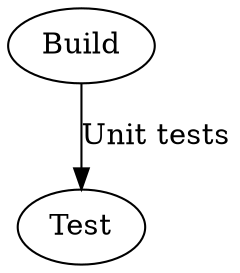
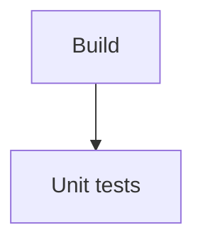
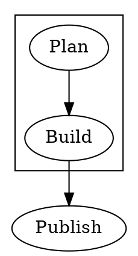
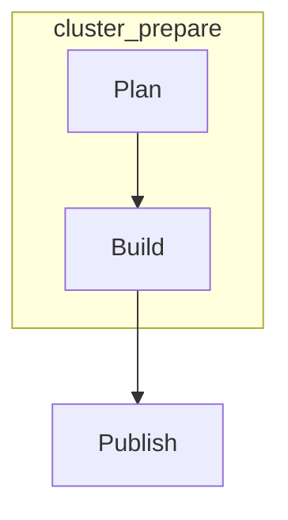

# Conversion Rules

dot2mermaid converts Graphviz DOT input into Mermaid `flowchart` output. The converter focuses on directed documentation diagrams that can be embedded in Markdown files, generated docs, and CI artifacts.

## Output Format

- The output starts with `flowchart <direction>`.
- The default direction is `TB`.
- Pass `--direction LR`, `--direction RL`, or `--direction BT` from the CLI to choose another Mermaid layout direction.
- Each converted edge is emitted as a Mermaid arrow: `from["from label"]-->to["to label"]`.

## Nodes and Labels

- Node ids become Mermaid node ids.
- Node labels become Mermaid node text.
- If a DOT node has no `label`, the node id is used as the visible text.
- When an edge has a `label`, that label is used as the visible text for the target node in the generated edge line.

Example:

## Edges

- Directed DOT edges (`->`) are converted to Mermaid directed arrows (`-->`).
- The converter is intended for `digraph` input.
- Undirected DOT edges (`--`) are outside the supported conversion target because Mermaid flowcharts need an explicit edge style.

## Subgraphs

- DOT `subgraph` blocks are emitted as Mermaid `subgraph ... end` blocks.
- The subgraph identifier is used as the Mermaid subgraph title.
- Parent-level edges are emitted before subgraph blocks.
- Mermaid does not show a parent graph label for an unlabeled subgraph. Add a DOT `label` when that text must appear in rendered documentation.

Example:

## Known Limitations

- Graph attributes such as `rankdir`, `shape`, `style`, `color`, and `rank` are not translated.
- Parent graph labels on unlabeled subgraphs are not rendered by Mermaid.
- Edge styles and arrowhead variants are not translated.
- Nested subgraphs are not a supported target.
- Very large output can hit Mermaid's `maxTextSize` limit when rendered.
- The converter preserves the supported graph structure; it does not run Graphviz layout.
